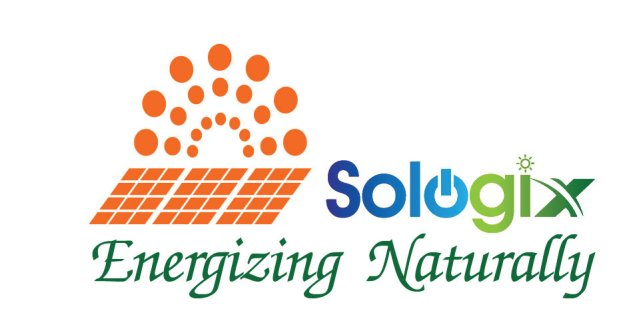

<div align="center">



# Sologix Solar Proposal System

**Internal proposal management system for Sologix Energy Private Limited**

[](https://python.org)
[](https://flask.palletsprojects.com)
[](https://mysql.com)
[](https://getbootstrap.com)
[](https://nginx.org)
[](https://cloud.google.com)
[](LICENSE)

</div>


## What it does

Sales teams use this to generate, manage, and track solar installation proposals — on-grid and hybrid systems. A proposal captures the customer details, system spec, bill of materials, pricing, add-ons, payment schedule, and warranty terms. The finished PDF is stamped with the company letterhead and versioned for reference.

**Core features:**
- Proposal lifecycle — Draft → Generated → Accepted / Rejected
- PDF generation with letterhead stamped on every page, version history
- On-grid and Hybrid system types (Hybrid includes battery row in BOM)
- User management with MASTER / USER roles and monthly quotas
- Company settings (bank details, GST, module makes, warranty text) editable from the UI
- Full audit log — every login attempt and action recorded with IP


## Tech Stack

| Layer | Technology |
|---|---|
| Backend | Python 3.12, Flask 3.1, SQLAlchemy 2.0 |
| Database | MySQL 8.0 |
| PDF | xhtml2pdf (generation) + reportlab + pypdf (letterhead stamping) |
| Auth & Security | Flask-Login, Werkzeug bcrypt, Flask-WTF CSRF, Flask-Limiter |
| Frontend | Bootstrap 5.3, Bootstrap Icons, vanilla JS |
| Server | Gunicorn + Nginx on GCP (Ubuntu 24.04, asia-south1-c) |


## Docs

| | |
|---|---|
| [Local Setup](docs/local-setup.md) | Run the app on your machine |
| [GCP Deployment](docs/gcp-setup.md) | Deploy to a GCP VM with one command |
| [Architecture](docs/architecture.md) | Directory structure, data model, request flow, security |
| [Key Decisions](docs/decisions.md) | Why we chose xhtml2pdf, Python letterhead stamping, and more |


## Quick Start (Local)

```bash
git clone https://github.com/Amanverma1011/InternshipProject.git && cd InternshipProject
python -m venv venv && source venv/bin/activate   # Windows: venv\Scripts\activate
pip install -r requirements.txt
mysql -u root -p < database/schema.sql
cp .env.example .env                              # fill in DB_PASSWORD
python database/seed_auto.py
python app.py                                     # → http://127.0.0.1:5000
```

## Quick Deploy (GCP VM)

```bash
curl -fsSL https://raw.githubusercontent.com/Amanverma1011/InternshipProject/main/deploy/setup_vm.sh | sudo bash
```

---

## License

GNU General Public License v3.0 — see [LICENSE](LICENSE).

*Sologix Energy Private Limited · Ranchi, Jharkhand · GSTIN: 20AAZCS9296C1ZT*
